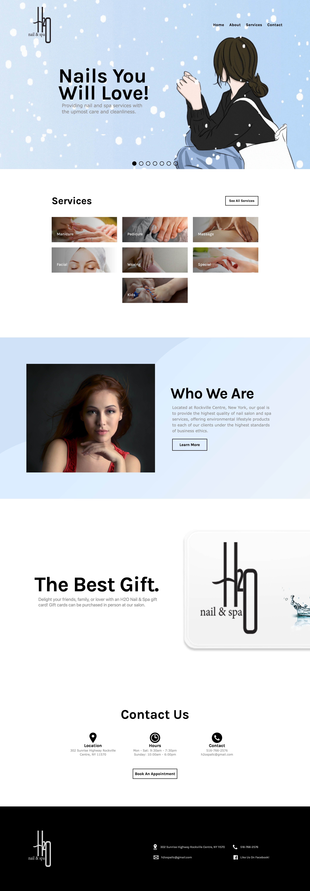

# H2O Nail & Spa



## Table of contents

- [Overview](#overview)
- [My process](#my-process)
  - [Built with](#built-with)
  - [What I learned](#what-i-learned)
  - [Continued development](#continued-development)

## Overview

Created a scalable responsive website for H2O Nail & Spa located at 302 Sunrise Highway Rockville Centre 11570. Features a mobile, tablet, and computer design. Includes an interactive navbar that leads to different pages containing information about the small business.

### Built with

- HTML5
- TailwindCSS
- ReactJS
- Mobile-first workflow

### What I learned

I learned about how to use the useEffect() hook in conjunction with the setInterval() hook to create a slider.

```jsx
useEffect(() => {
  let interval = setInterval(() => {
    setCurrentPic(currentPic === pictures.length - 1 ? 0 : currentPic + 1);
  }, 3000);

  return () => clearInterval(interval);
}, [currentPic]);
```

I learned how to make custom animations using Framer Motion and the React Intersection Observer API.

```jsx
export default function Motion({ className, children, duration }) {
  const time = duration;

  const fadeDown = {
    visible: { opacity: 1, y: 0, transition: { duration: time } },
    hidden: { opacity: 0, y: -25 },
  };

  const control = useAnimation();
  const [ref, inView] = useInView();

  useEffect(() => {
    if (inView) {
      control.start("visible");
    }
  }, [control, inView]);

  return (
    <motion.div
      ref={ref}
      variants={fadeDown}
      animate={control}
      initial="hidden"
      className={className}
    >
      {children}
    </motion.div>
  );
}
```

I learned about the process behind web development and how difficult it is to design an appealing layout.

### Continued development

As of now, I'm still a novice at web development so there's still a lot for me to learn. In the future, I will like to come back to this project and revamp it with a improved interface and better structuring.

I also have plans of adding a gallery to showcase different types of nails the business provides.
